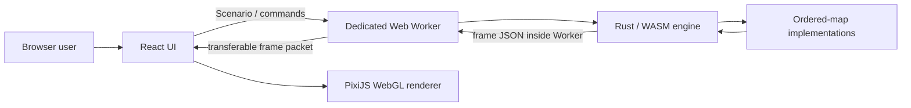

# Ordered Map Algorithm Visualizer 設計

## 目的と範囲

このアプリケーションは、ordered map の公開操作と内部構造の変化を同じ時間軸で観察するためのクライアントサイド Web アプリケーションである。利用者は初期状態と操作列を入力または再現可能な方法で生成し、構造、イベント、疑似コード、計測値を同期して確認できる。

対象とする ordered map は、[`alg-playground/crates/ordered_map`](https://github.com/to-omer/alg-playground/tree/1d6564b21bab0dca11b75383ed630564e47cf9f6/crates/ordered_map) の実装分類に対応する次の13種類である。参照commitを固定し、元リポジトリの将来変更によって本アプリケーションの意味を暗黙に変えない。

- AVL tree
- Weight-balanced tree
- AA tree
- Left-leaning red-black tree
- Treap
- Zip tree
- Splay tree
- Scapegoat tree
- Skip list
- B-tree
- sparse van Emde Boas tree
- X-fast trie
- Y-fast trie

参照元に含まれる `StdBTreeMap` と `SortedVecMap` は比較用baselineであり、内部アルゴリズムの可視化対象から除外する。`RbTreeMap` は現時点で LLRB のthin wrapper、`FusionTreeMap` はskeletonであるため、独立した動作を持つ実装になった時点で新しいrevisionとして追加する。

アプリケーションは別リポジトリとして完結し、元リポジトリを実行時依存にしない。バックエンド、ユーザーアカウント、共同編集、任意コード実行、モバイル専用 UI は対象外とする。

将来の sort や flow はビルド時プラグインとして追加する。実行時に第三者コードを読み込む仕組みは持たない。

## 利用者が行えること

### シナリオの作成

利用者は次の方法を組み合わせてシナリオを作成できる。

- Scenario JSON を CodeMirror で編集する
- 初期要素と操作列を行指向 DSL で編集する
- 単一操作フォームから DSL へ操作を追加する
- 初期要素または操作列を seed 付き generator で生成する
- Scenario JSON ファイルを import する
- 検証済み Scenario を RFC 8785 canonical JSON として export する

JSON と DSL の意味解釈、generator、algorithm parameter の検証は Rust/WASM が行う。64 MiBの転送前byte budgetだけは、main threadとWorkerがallocationを伴わない早期打ち切りUTF-8計数で先に検査し、WASM側でも同じ上限を強制する。

### 再生と観察

再生機能は次の操作を持つ。

- 再生、一時停止、前後 step、先頭と末尾への移動
- 0.25、0.5、1、2、4、8、16、32倍速
- semantic event と atomic event の表示粒度切り替え。どちらもcompareは探索順に一件ずつ表示し、descendは独立stepを消費せず次の対象へ向かうedge animationとして表す
- timeline slider による任意位置への seek
- entity数に応じた自動LOD
- pan、zoom、選択、全体へのcamera fit、現在の実行対象を画面中央で追跡するcamera mode
- OS の reduced-motion 設定への追従

選択中の構造要素に対して、値、構造固有 metadata、不変条件、理論計算量、累積 metrics を表示する。現在の trace event には日本語の説明と同期した疑似コードを表示する。

### 入力言語

初期状態の DSL は `insert` のみ、操作列は4操作を受け付ける。

```text
# comment
insert 42 "value"
get 42
lower_bound 40
remove 42
```

key は `0` から `18446744073709551615` までの canonical unsigned decimal とする。先頭ゼロ、符号、桁あふれを拒否する。value は JSON string literal とし、Unicode scalar value で256文字までとする。UTF-8 BOM は入力先頭の1個だけを許し、LF と CRLF を受理する。診断位置は editor と一致する UTF-16 code unit の1始まり行・列で返す。

### Generator

generator は次を指定できる。

- initial または operations
- unsigned 64-bit seed
- 件数
- key の包含範囲
- uniform、ascending、descending、hotspot distribution
- value prefix と最大長
- operation ごとの非負 weight
- get hit、remove hit、insert overwrite の basis point 比率

同じ generator revision、seed、設定、初期状態からは byte 単位で同じ materialized sequence を生成する。要求された比率は largest-remainder で整数件数へ変換する。現在の要素数と key universe から実行不能な要求を事前に拒否し、暗黙の比率変更や別分布への fallback は行わない。

生成結果には generator revision、設定、materialized payload の SHA-256、実績件数を provenance として保存する。利用者が生成結果を編集した場合は provenance を削除し、編集後の値を生成物として偽装しない。

## 制約と受け入れ基準

### 入力と転送の上限

| 対象 | 上限 |
|---|---:|
| initial entries | 10,000 |
| operations | 100,000 |
| JSON import | 64 MiB |
| DSL input | 64 MiB |
| value | 256 Unicode scalar values |
| transferable frame packet | 32 MiB |
| timeline items | 110,000 |
| visual entities | 250,000 |
| trace events in one commit | 250,000 |
| state patch records in one commit | 1,000,000 |

上限は allocation 後ではなく、ファイルサイズ、decoded count、packet header の各境界で検査する。上限超過時は処理を縮退せず、修正可能なエラーとして終了する。

### 応答性

性能判定は development server ではなく production build を使う。1440×900 の headless browser で次を満たすことを継続的に検査する。

- 1,000 initial entries は全entityを詳細描画する
- 1,000 entityを32倍速で3秒再生し、p95 frame gapを35 ms未満に保ち、main threadの50 ms以上のlong taskを発生させない
- 5,000 initial entries は全entityを詳細描画し、静止表示中のp95 frame gapを35 ms未満に保つ
- 10,000 initial entries を自動summary LODでloadし、main threadの50 ms以上のlong taskを発生させない
- 100,000 operations の先端 seek は10秒以内に完了し、途中経過を表示する
- 同じシナリオの先頭への後方 seek は2秒以内に完了する
- 通常再生を10秒継続して main thread の50 ms以上の long taskを発生させない
- WebGL context loss 後に描画状態を復元できる
- 1操作内で複数回の回転、split、mergeが発生しても、各構造変更eventを別々のanimationとして再生する

絶対時間は GitHub Actions の共有 runner でも安定する閾値にする。比較ベンチマークやアルゴリズム間順位の根拠には使用しない。

### 描画品質

8,000 entityまでは全nodeとedgeをdetail modeで描画する。500 entityまではnodeごとのvector shapeとlabelを保持し、それを超える場合はnodeをpositionだけがdynamicな軽量particleとしてbatch描画する。100 entityまでは全体fit時も全labelを表示し、500 entityまではzoomに応じたsemantic label表示とする。現在の操作対象と選択対象は画面上で一定サイズのmarkerまたはlabelを残す。8,000 entityを超える場合はrootからの上位構造と全体からの決定的samplingを組み合わせたsummary primitiveを最大2,000個表示する。summaryには現在のイベント対象、利用者の選択対象、操作内の訪問履歴の順で優先して含める。利用者にLOD選択を要求せず、総entity数と現在のLODは観測可能にする。summary geometry はscene変更時だけ再構築し、animation tickごとに作り直さない。

500 entityを超える詳細表示の全体fitでは、key順の横軸とgraph depthの縦軸を独立して画面へ収める。edgeは1画素線、nodeは画面上で一定の小さいparticleとして描き、全体表示でも木の階層形状を潰さない。閾値付近のinsert/removeで描画方式が往復しないようdetail particle modeの解除には450 entityのhysteresisを設け、削除event中のparticleは旧位置にmutation色で保持する。1,000 entityの受け入れ検査では、全entityを保持したまま描画範囲がviewport高の60%以上を占めることを確認する。panとzoom中もparticleのscreen positionだけを更新する。

構造変更eventは、そのeventに付属する可逆state patchの直前状態から直後状態へ補間する。nodeはstable entity IDを保って移動し、削除されるedgeはフェードアウトし、作成されるedgeはsourceからtargetへ伸長する。1操作内で複数の回転、split、mergeが発生した場合もpatchをまとめず、eventごとに直前の構造から次の構造へ遷移する。

補間時間は再生速度に応じて90から520 msとし、低速では構造変化を読み取れる長さ、高速では次のeventを妨げない長さにする。reduced motion が有効な場合は各patchの直後状態へ即時に移る。labelはentity数とzoomを併用したsemantic zoomで制御し、小規模入力の全体fitで一律に消さない。単一nodeのauto-fitは1.75倍を上限としてtext textureと輪郭の過剰拡大を避ける。rendererとtext textureはdevice pixel ratioに追従する。

## アーキテクチャ



main thread は入力、再生 state、packet validation、scene 公開、camera、DOM inspector を担当する。重い parse、生成、algorithm 実行、snapshot 作成、seek replay は Dedicated Worker 内の WASM が担当する。

### リポジトリ構成

| 場所 | 責務 |
|---|---|
| `crates/visualizer-core` | Scenario envelope、DSL、generator、RNG、canonical JSON、stable arena、plugin registry contract、可逆patch transaction |
| `crates/ordered-map` | 13構造の実装、共通操作、trace recorder、ordered-map state patch、metrics、snapshot |
| `crates/visualizer-wasm` | Worker から使用する session API と seek index |
| `apps/web` | React UI、Worker host、packet decoder、trace replay controller、Pixi renderer |
| `packages/contracts` | Rust と TypeScript の canonical JSON 交差検証 |
| `tests/browser` | production build を使う利用者フローと性能検査 |

依存方向は `visualizer-core <- ordered-map <- visualizer-wasm` とする。Web UI は生成された WASM API と versioned message 型だけを通じて engine を利用する。

### Session と Worker

Worker は同時に1つの `WasmSession` を所有する。main thread は要求ごとに単調増加する generation を付け、古い generation の応答を破棄する。新しい create は既存 session を明示的に解放する。

session 作成時に hidden initial build を適用する。`show_build=true` の場合だけ initial insert を timeline item として公開する。公開 cursor は適用済み item 数を表し、範囲は `0..=item_count` である。

seek は最大128 itemの chunkで replayし、各 chunk の間を macrotask へ yield する。main thread は進捗を表示し、別 generation が始まった場合は古い seek を公開しない。

### Background seek index

session は表示用 state と独立した algorithm state を使い、Worker の空き時間に最大128 itemずつ seek coverage を伸ばす。2,048 item ごとと終端に algorithm state を checkpoint として保持する。

checkpoint は最大32個、保守的会計で合計64 MiBに制限する。会計値はarena、値payload、入れ子collectionのcapacityを数え、B-tree/Hash tableのnode・control領域とallocator overheadを覆う4倍の安全係数と固定overheadを加える。新checkpointの会計値を計算し、既存checkpointを必要数evictしてadmissionが成功した後にだけalgorithm stateをcloneする。上限を超えると隣接間隔が最も狭い中間 checkpoint を削除し、時間軸全体へ分散させる。seek は現在 state と target 以下の直近 checkpoint を比較し、replay 距離が短い方を選ぶ。checkpoint が利用できない後方 seek は canonical Scenario から決定論的に再構築する。

index 構築は foreground 操作と同じ Worker event loop 上で交互に進み、UI thread を占有しない。coverage は timeline に表示する。

### Transferable frame packet

WASM が返す frame JSON はWorker内でenvelope、最終node、最終entry、trace、state patchの行recordへ分割してUTF-8 encodeし、単一の `ArrayBuffer` としてtransferする。main threadへ大きなobject graphをstructured cloneせず、巨大な単一JSON valueもparseしない。

packet headerはlittle-endianの固定16 bytesで、magic、version、frame kind、used byte length、payload byte lengthを持つ。main threadは32 MiB上限、kind、reserved byte、宣言長、fatal UTF-8 decode、node、entry、trace、patchのrecord countをallocation前に検査する。envelopeは64 KiB、個別recordは1 MiBを上限とする。非同期decoderはenvelopeを最初に検証し、宣言record数を超える改行を配列へ追加する前に拒否する。各recordのparseとstate patchの前提検証は分割し、macrotaskの間でevent loopへ制御を返す。検証に成功したframeだけを公開する。packet versionはfull stateのcurrent frameとdelta-only commit frameを区別するversion 5とし、永続化対象ではない旧packetとの実行時互換は持たない。

frame kind は current state と operation commit を区別する。current frameはload、seek、renderer recoveryでtimeline境界のfull stateを持つ。commit frameはoperation result、initial-build flag、trace sequence、各eventが参照するstate patch spanだけを持つ。可視operationのproducerは送信前にpatch列を独立に取得した最終snapshotへ照合するため、変更していない巨大なfull stateをoperationごとにWorkerから再転送しない。

commit envelopeは`baseItemIndex`と`itemIndex`を持つ。main threadは現在保持するcommit境界が`baseItemIndex`と一致する場合だけdecodeを続ける。decoderはrecord型、stable identity、連続するpatch span、producer上限を検証し、trace replay controllerはbase stateへ全patchをforward適用して各patchのpreconditionと変更対象の参照整合性を検証してからstateを公開する。generation、base境界、patch前提のいずれかが一致しない場合はpacketを適用せず、commit拒否ACKを返す。

create、visible itemの前進、seekは二段階publicationとする。createは新sessionをcandidateとして保持し、main threadがcurrent frameを検証して承認ACKを返すまで既存sessionを置き換えない。前進では、WASM sessionがalgorithmを未公開状態へ進め、trace検証とbounded frame serializationを行う。この間もcommitted cursorは変更しない。Workerはframeを32 MiB以下のtransferable packetへ変換してmain threadへ送り、main threadが非同期decode、patch検証、replay state公開を終えた後の承認ACKを受けて初めてcursorをcommitする。拒否ACKまたはACK前の別requestでは、直近checkpointまたはcanonical Scenarioからcommitted cursorまでreplayしてalgorithmを復元する。serialization、packet化、transferの同期失敗でも同様に復元する。これにより成功する各operationで大規模algorithm全体をcloneせず、generation変更中のstale packetがWorkerだけを先行させることもない。seekは現在algorithmまたは選択checkpointをcloneしたcandidateで進め、current frameの承認ACK後だけcandidateをcommitする。途中経過はcandidate cursorだけを通知する。失敗時はcandidateを破棄し、どの経路でも直前scene、algorithm、cursorの一致を保つ。

seek中に別requestを受けた場合、Workerは新requestを処理する前にstaged seekを破棄する。古いtimer callbackはgeneration不一致なら何も変更せず終了し、新しいseek candidateを誤って破棄しない。Exportによるcancel後もcurrent cursorはseek開始前の境界に留まり、次のstepをそこから実行できる。

### Failure handling

- invalid Scenario、DSL、parameter、generator request は最後に成功した scene と操作可能なsessionを置き換えない。新sessionは初期frameのbounded serializationまで成功してから原子的にswapする
- createはcandidate session、operationはACK待ちの未公開state、seekは隔離candidate上で実行する。main threadのframe検証・公開が成功するまでactive sessionまたはcursorへcommitしない。publication失敗、新generation request、拒否ACKではcandidateを破棄し、operationだけは最後のcommitted境界へ再構築する
- Worker response の generation が現在値と異なる場合は適用しない
- malformed packet は scene を公開せず session を error 状態にする
- state patchのbefore/after不一致、重複ID、順序違反、非連続spanはframeを公開せずsessionをerror状態にする。producer側でpatch適用結果と独立full stateが不一致の場合はpacket自体を生成しない
- visual entity、trace event、patch recordの上限はRust producerがsnapshot・event追加前に検査する。packet byte上限はbounded serializerで検査し、上限を超えるoperationはeventを結合したりanimationを省略したりせず、修正可能なbounded-resource errorで終了する
- Worker responseは入力検証失敗とengine runtime失敗を分類する。入力失敗と、producerが変更前に検出したvisual entity・trace・patch・frame byteのbounded-resource errorは、直前のcommitted sceneとsessionを保持して修正・再試行できる。これら以外のnext/seek/WASM/packet publication失敗はsessionの信頼性を保証できないためfatal errorとして全engine依存操作を無効にする
- React描画中の未捕捉例外は画面全体を空にせず、再読み込み可能なfatal error surfaceへ隔離する
- WebGL context loss では再生を止め、restore 後に現在 cursor へ seek して scene を再送する
- context が5秒以内に復元しない場合は error を表示する
- import は `File.size` を確認してから `ArrayBuffer` として transferする
- value に含まれる bidi と制御文字は inspector で可視化し、画面の方向性を偽装させない

自動的に別 algorithm、別分布、低詳細の意味状態へ切り替える fallback は行わない。表示 LOD は意味状態を変更しないため許容する。

## データ契約

### Scenario JSON

Scenario は strict JSON object とし、unknown field と duplicate field を拒否する。永続化時は RFC 8785 JSON Canonicalization Scheme を使用する。JavaScript で正確に扱えない `u64` は canonical decimal string として表す。

```json
{
  "schema_version": 1,
  "scenario_encoding_revision": "rfc8785-jcs/1",
  "plugin": "ordered-map",
  "reproducibility": {
    "declared": {
      "algorithm_revision": "ordered-map/1",
      "rng_version": 1,
      "plugin_result_revision": "ordered-map-result/1",
      "metrics_catalog_revision": "ordered-map-metrics/1",
      "trace_revision": "ordered-map-trace/3",
      "projection_revision": "ordered-map-projection/2",
      "layout_revision": "ordered-map-layout/1",
      "frame_encoding_revision": "scene-frame/5"
    }
  },
  "payload": {
    "algorithm": { "id": "avl", "config": {} },
    "algorithm_seed": "42",
    "initial": {
      "entries": [{ "key": "8", "value": "root" }],
      "show_build": false
    },
    "operations": {
      "items": [{ "op": "lower_bound", "key": "7" }]
    }
  }
}
```

revision field は保存データの意味を固定する。未対応の実行必須 revision は拒否する。provenance の既知 revision は materialized payload digest と照合する。未知 provenance は raw metadata として保持できるが、検証済みとは表示しない。

既存Scenarioが旧traceまたはprojection revisionを宣言している場合、materialized initial entriesとoperationsは実行できるが、画面に`Legacy input · current trace`と表示して旧derived outputを再現したとは表示しない。import時にrevisionを自動で書き換えず、次に新規生成、parameter変更、DSL適用、または明示的な編集を行ったScenarioから新revisionを宣言する。未loadの編集は`Edited · not loaded`と表示し、`Run trace`は必ず編集内容を検証してから開始する。

### Algorithm parameter

| Algorithm | Parameter | 有効範囲 |
|---|---|---|
| Scapegoat | `alpha_numerator / alpha_denominator` | 既約、`1/2 < alpha < 1`、denominator 64以下 |
| Skip list | `promotion` | `1/2` または `1/4` |
| Skip list | `max_level` | 1から64 |
| B-tree | `min_degree` | 2から16 |
| vEB / X-fast / Y-fast | `word_bits` | 1から64 |

parameter を持たない構造の `config` は空 object とする。

### Operation と結果

公開操作は `insert`、`remove`、`get`、`lower_bound` の4種類である。insert は key が存在しない場合に新規 entry を作り、存在する場合は stable `EntryId` を保って value を上書きする。remove/get/lower_bound の不成立は error ではなく `miss` result とする。

Splay の read と miss は構造を変化させ得る。randomized 構造は新規 insert のときだけ algorithm RNG を消費し、overwrite と read では消費しない。

結果は inserted、overwritten、removed、miss、found の tagged union とする。found は key と value、mutation result は対象 `EntryId`、overwrite/remove は以前の value を必要に応じて保持する。

### Stable identity

logical entry、structural node、auxiliary structure は generation 付き arena keyを持つ。削除済み key は再利用された slotを参照できない。free-list 順序を含む compact codec の round trip 後も、次回 allocation の ID sequence を維持する。

entry が B-tree node 間を移動する場合や subtree rebuild が起きる場合も `EntryId` を維持する。物理 node と logical entry を同一 ID にしない。

### Trace と metrics

trace event は renderer 非依存で、次の semantic kind を持つ。

- compare、descend
- insert、overwrite、remove
- rotate-left、rotate-right
- update-metadata、rebuild
- split、merge、move-entry
- result

event は安定した catalog ID、種別を保持した該当structure entity、descend時の遷移先entity、entry、key、state patch spanを持つ。UI は kind と catalog IDから説明、疑似コード、現在の操作対象を得る。状態を変えないeventのpatch spanは空とする。

UIは現在eventまでのtrace prefixから、その操作で触れたnodeとedgeを導出する。比較では現在nodeと、検索keyを所有するnodeが存在する場合の両方を同時に強調する。検索keyがまだ構造内に存在しない場合は、存在しないnodeを偽装せず、現在nodeと画面上のQUERY operandを同時に強調する。次の可視event直前に連続するdescend runでは、最後の有効な遷移元と遷移先を結ぶ実在edgeを、青緑から黄橙へ変化する向き付きの光が移動する時間gradientとして描く。移動先はdescendのtargetだけから決め、次eventから推測しない。構造変更ではeventのpatch spanにあるbefore/after nodeから、削除済みnodeを含む変更頂点と生成・消滅edgeを導出する。回転では旧rootとpivot、および両者を結ぶedgeを同時に強調する。操作履歴は青緑、現在の比較は黄、現在の構造変更は橙を使い、利用者の選択は意味色を消さない独立outlineで表す。未来のtrace eventは訪問履歴へ含めない。

semantic/atomic表示のどちらもdescendを独立stepとして公開しない。rootのcompareからchildのcompareへ一stepで進み、その遷移時間内に選択edgeのgradientを再生する。vEBのようにcompareを発行しない探索は、連続するdescendを次の結果eventへ折り畳み、最後の有効なedgeと到達先を表示する。child compareへ到達するまではinsert先やhit先を強調しない。metadataだけの連続更新は、projectionを変更しない場合に限ってsemantic境界へまとめてよい。

metrics は comparison、node visit、bit test、rotation、recolor、split、merge、rebuild item、allocation、free の絶対累積値である。値は decimal string で Worker 境界を越え、差分の加算誤差や `Number` overflow を避ける。

operation resultはcommit frameに一度だけ保持し、`result` eventへ到達するまでinspectorへ公開しない。trace途中でfound value、miss、以前のvalueを先行表示しない。

### Event state patch

traceの各eventは、画面に公開する状態を直前eventから直後eventへ変える可逆patchを参照する。patchは次の3領域を一つのtransactionとして変更する。

- projection rootと、stable IDで識別する構造node
- stable `EntryId`で識別するcanonical entry
- catalog ordinalで識別する累積metric

ordered mapのpatch recordは次の形を持つ。`before`と`after`の一方がnullの場合はentityの作成または削除を表す。

```text
StatePatch {
  root: ValueChange<StructureEntityId | null> | null
  nodes: EntityChange<StructureEntityId, StructureNode>[]
  entries: EntityChange<EntryId, CanonicalEntry>[]
  metrics: MetricChange[]
}

EntityChange<Id, Value> {
  id: Id
  before: Value | null
  after: Value | null
}

ValueChange<Value> {
  before: Value
  after: Value
}

MetricChange {
  ordinal: MetricOrdinal
  before: DecimalU64
  after: DecimalU64
}
```

node recordはlinks、entries、keys、metadataを含むため、rotationは旧root、pivot、middle subtree、incoming parentまたはprojection rootの変更を一つのpatchへ格納できる。double rotationは二つのrotate eventと二つのpatchに分ける。split、merge、rebuildもalgorithmが意味上の一操作として公開する単位ごとにpatchを分ける。

patch内のIDは昇順かつ重複なしとする。forward適用では現在値が`before`と一致すること、reverse適用では現在値が`after`と一致することを全recordについて確認してからtransactionを反映する。一件でも一致しない場合は部分適用せずframe全体を拒否する。

eventごとのfull snapshotは保持しない。main threadはtrace開始時のbase stateと可逆patch列だけを保持する。producerはoperation境界の最終full stateを独立oracleとして照合するがpacketには含めない。semantic表示がatomic eventを省略する場合も、選択したraw eventまでのpatchを順に適用する。projection patchを持つeventはsemantic粒度でも省略せず、複数の構造変更を一つのanimationへ畳み込まない。

patch生成と適用の計算量は変更recordと、その変更で参照元・参照先になったentity数に比例させる。TraceStateとfrontend replay stateはincoming-link、entry-owner、logical-key indexを増分更新し、各eventで全entityのreachabilityやkey集合を再走査しない。operation境界の独立full snapshot構築と最終照合は一度だけ行い、event数と全entity数の積に比例する処理や転送を行わない。subtree全体を変更するrebuildは、実際に変更したentity数に比例するpatchを許容する。

初期木の非表示構築、seek、background indexはevent一覧だけを必要とし、projection snapshotとpatchを生成しない。projection構築はrecording対象の可視operationであることを確認してから遅延実行する。したがって、非表示replayの各eventで全entity snapshotを構築する実装は禁止する。

### 構造変更の時間契約

projectionを変える一つのalgorithm mutationは、ちょうど一つのtrace eventが所有する。algorithmはpointer、root、metadataをそのeventの意味上のtransactionとして変更し、外部から参照可能な整合した状態になった直後にpatchを確定する。次のprojection mutationを始めてから前のeventを記録すること、複数のrotationを一つのpatchへまとめること、operation完了後のsnapshotから途中状態を推測することを禁止する。

AVLの初期木`[3, 1]`へ`insert 2`を適用するLR double rotationは、少なくとも次の独立したprojection状態を通る。edge表記は`source -role-> target`とする。

| event直後 | root | edge集合 |
|---|---:|---|
| insert | 3 | `3 -left-> 1`, `1 -right-> 2` |
| rotate-left | 3 | `3 -left-> 2`, `2 -left-> 1` |
| rotate-right | 2 | `2 -left-> 1`, `2 -right-> 3` |

`rotate-left`のpatchの`before`はinsert後の状態、`after`は上表の中間状態でなければならない。続く`rotate-right`の`before`はその中間状態と完全一致し、`after`だけがoperation境界の最終状態と一致する。rendererは各projection eventについて現在stateからpatch適用後stateへのanimationを一つずつ開始する。高速再生でもdurationを短縮するだけで、中間stateの適用、event説明、強調対象、metrics更新を省略しない。

削除とその後の修復も同じ時間契約に従う。`remove` eventの直後には対象nodeとentryがlive stateから消え、残存nodeはrootから到達可能でなければならない。削除済みnodeを後続rotationの仮想的な親として残し、最後のsnapshotでまとめて消すことは禁止する。Splay treeで左右の部分木を結合する場合、`remove` eventが右部分木を左部分木の最大nodeへ接続して対象を削除し、その時点の有効な木を確定する。続いて最大nodeをrootへ移す各rotationを、それぞれ独立したeventとpatchとして記録する。逆再生はrotationを一件ずつ戻した後、`remove` patchを反転して対象nodeとentryを復元する。

## Ordered-map 実装

全構造は同じ `OrderedMap` interface を実装する。

```rust
pub trait OrderedMap {
    fn apply(
        &mut self,
        operation: Operation,
        trace: &mut Vec<TraceEvent>,
    ) -> Result<OperationResult, MapError>;

    fn canonical_snapshot(&self) -> CanonicalSnapshot;
    fn structure_snapshot(&self) -> StructureSnapshot;
    fn check_invariants(&self) -> Result<(), InvariantViolation>;
    fn estimated_bytes(&self) -> usize;
}

impl AlgorithmInstance {
    fn apply_recorded(
        &mut self,
        operation: Operation,
    ) -> Result<RecordedOperation, MapError>;
}
```

`OrderedMap::apply`は初期木の非表示構築、seek、background indexでraw eventだけを記録する経路である。可視operationは`AlgorithmInstance::apply_recorded_reconstructible`から各実装のrecording経路をexhaustiveにdispatchし、event patchと最終oracleを生成する。この経路はsessionが失敗時の再構築境界を持つ場合だけ使う。単独のatomic APIである`apply_recorded`はcloneしたcandidateをstageして、失敗時にreceiverを不変に保つ。実行時 dispatch は `AlgorithmInstance` enum の exhaustive `match` を使う。trait object、動的 library loading、JavaScript 側 algorithm 実装は使用しない。各構造は canonical contents と構造 snapshotを独立して返すため、意味の正しさと物理形状を別々に検証できる。

production の1操作ごとの full invariant check は行わない。共通 model test、構造固有 test、property test では各操作後に invariant を確認する。

`OrderedMapTraceRecorder`はoperation開始時のprojection、canonical entries、metricsをshadow stateとして所有する。algorithmは観察eventを`record`、状態変更eventを`record_transition`へ渡す。`record_transition`はpatch全体の前提を検査し、成功した場合だけshadow stateとtraceを同時に進める。rendererはevent kindや説明用node IDから構造変更を推測しない。

binary rotation、multiway split/merge、rebuild、entry移動にはprojection helperを用意する。helperはshadow stateからincoming edgeやrootを解決し、変更されたnodeの完全なbefore/after recordを生成する。algorithm内部のpointer更新を直接renderer contractへ漏らさない。event境界はprojection transactionが完了した位置に置き、途中の不整合なpointer状態を公開しない。

operation完了時に、recorderがpatchを適用して得たshadow stateを、`structure_snapshot`と`canonical_snapshot`から独立に構築した最終stateへ照合する。root、node、link、entry、key、value、metadata、metricsのいずれかが一致しなければcommit frameを生成しない。この照合を省略できるproduction fast pathは設けない。

### 決定性

generator RNG と algorithm RNG は別 seed/domain に分離する。64-bit arithmetic は wrapping operationを明示し、bounded sampling は modulo biasを避ける。hash table の iteration 順を結果、trace、snapshot 順序に使用しない。

同じ Scenario と cursor からは次を一致させる。

- canonical entries と stable ID
- structure snapshot
- algorithm RNG state
- operation result と trace sequence
- absolute metrics
- canonical export bytes

## 描画設計

`StructureSnapshot` は root、node、entry、role付き link、key、metadata からなる。renderer は algorithm 内部 pointerを参照しない。

binary tree、multiway tree、list、integer-universe structure を同じ scene primitiveへ投影する。node role と metadata は構造差を保持し、auxiliary entity は primary node と異なる形状で描く。B-tree nodeは格納keyを区切った横長shapeとして描き、Inspectorでもnode内の全keyを確認できる。vEB cluster、X-fast prefix、Y-fast representative は node label と role に反映する。

layout は key order と graph depthを用いる決定的な配置とする。binary treeは大域的key rankで左右関係を保持する。B-tree、vEBなどの非binary projectionはdepthごとにnodeの実表示幅とgapから一意なslotを割り当て、同じkeyや空keyを持つauxiliary nodeも同一座標へ置かない。詳細LODはrootから到達可能な全entityに加えてdisconnected auxiliary entityも配置する。summary LODはrootからの上位構造、決定的sampling、現在のevent対象、利用者の選択対象、操作内の訪問履歴を組み合わせ、2,000 entityの上限を維持する。

camera state は algorithm state と分離する。新しい scene でauto-fitが有効なら全体へfitし、利用者がpan/zoomするとauto-fitを解除する。`Fit tree`操作で再度fitする。`Follow execution`は利用者の選択とは独立し、現在eventのactive nodeが変わるたびに現在zoomを保ったまま画面中央へ指数補間で追跡する。手動pan/zoomまたは`Fit tree`で追跡を解除する。500 entityを超える詳細表示のfitは横軸と縦軸を独立して収め、通常の詳細表示とsummary表示は縦横比を保つ。

frontendの`TraceReplayController`はoperation直前のbase state、現在のraw event位置、可逆patch列を所有する。前進時は選択eventまでforward適用し、後退時は現在位置からreverse適用する。projection、canonical entry、metricsを同じtransactionで進め、canvas、inspector、metrics、説明、疑似コードへ同じevent位置のstateを公開する。operation resultはresult eventまで先行表示しない。

replay cacheはstable ID index、structure、sorted canonical entries、metrics wrapperを分離する。current full frameから最初にstable ID indexを作る場合は1,024 recordsごとにevent loopへyieldし、operation境界に到達したindexは次のoperationへ所有権を移して再利用する。metricだけのeventはstructureとentry配列の参照を再利用し、entry変更時だけkey sortをやり直す。trace presentationは同じstructure参照に対するentry/key ownershipとadjacencyを一度だけ索引化し、前進再生では直前eventから訪問集合を増分更新する。dense rendererはstructureまたはLODが変わった時だけparticle membershipを再構築し、観測eventでは強調が変わったparticleだけを更新する。

patch適用は変更対象をstable IDで引けるindex上で行い、eventごとのfull state copyを作らない。適用前にpatch全体を検証し、成功後に単一のstate versionを公開する。rendererはversionごとのprojection差分を受け取り、projection patchを持つeventだけgeometry animationを開始する。seek、context restore、新しいScenarioのloadではtrace replay stateを破棄し、Workerが返すtimeline境界のfull stateから再開する。

## 拡張境界

core は plugin ordinal、Scenario envelope、timeline cursor、metrics vector、opaque result payloadのbuild-time registry contractを持つ。現在の実行経路はordered-map専用のframe、patch、replay、layout型を使い、これらをplugin非依存であるとは扱わない。`PluginRegistry`はordinalとcatalog revisionの追加規則を固定するが、単独で新pluginを実行可能にする動的plugin機構ではない。

pluginは入力schema、algorithm/config union、trace catalog、metrics catalog、result schema、可逆state patch、projection、layout、inspector presentationからなる一つのvertical sliceとして追加する。追加時にはWASM sessionのbuild-time enum、packet payloadのplugin判別variant、main threadのdecoder/replay adapter、renderer adapterを同時に登録する。generation、二段階publication、seek/playback scheduling、packet header、camera shell、CSP、deploymentはplugin payloadを解釈しない共有部分として維持する。これにより新plugin追加時の変更点を明示しつつ、現時点で使われない汎用traitやopaque payload変換をproduction経路へ持ち込まない。

sort や flow を追加するときは次を追加する。

- Rust plugin crate、WASM sessionのbuild-time enum variant、registry descriptor
- Scenario payload と generator
- result、trace、metrics catalog
- plugin stateの可逆patchとplugin固有sceneへのprojection
- packet payload variant、frontend decoder/replay、layout/renderer、入力panel、inspector adapter

Worker generation、seek/playback controller、transferable packet header、camera shell、CSP、deployment は再利用する。registry contractのextension testでは、新しいdescriptorを追加しても既存ordinalやrevisionの意味を変更しないことを検査する。plugin固有adapterの結線は、追加したpluginのproduction browser testで検査する。

## ライブラリとツールチェーン

依存は lockfile と exact versionで固定し、更新 PR でまとめて検証する。

| 選定 | Version | 用途と理由 |
|---|---:|---|
| React | 19.2.7 | 入力、再生、inspector の宣言的 UI。公式の現行 19.2 系を使う |
| Zustand | 5.0.14 | 小さい playback store。Provider や大きな reducer boilerplateを増やさない |
| PixiJS | 8.19.0 | GPU accelerated 2D scene。WebGL rendererとposition-dynamicなParticleContainerで大きな木をbatch描画する |
| CodeMirror | 6.x exact packages | 大きな JSON/DSL document、selection、診断、keyboard interaction |
| Radix Dialog / Tooltip | 1.x exact packages | focus management と WAI-ARIA patternを備えた overlay primitive |
| Vite | 8.1.4 | ESM development、module Worker、WASM asset、static production build |
| TypeScript | 7.0.2 | native compilerによる primary typecheck |
| TypeScript compatibility package | 6.0.2 | TS 7移行期の互換性を同じ sourceで検査する `tsc6` |
| Rust | 1.94.0 | deterministic engine と WASM |
| wasm-bindgen | 0.2.121 | Rust/WASM と Worker JavaScript の境界 |
| Playwright | 1.61.1 | Chromium、Firefox、WebKit の production E2E |
| Biome | 2.5.3 | TypeScript/JSON formatting と lint |

TypeScript 7 は programmatic APIを持たないため、compiler APIを要求する tooling には公式互換 packageを使う。primary と compatibility の両方で typecheckする。[TypeScript 7 release](https://devblogs.microsoft.com/typescript/announcing-typescript-7-0/)

PixiJS は WebGPU を experimental として扱い、browser implementation差を避けるため WebGLを採用する。[PixiJS renderer guide](https://pixijs.com/8.x/guides/components/renderers)

500から8,000 entityのnode描画には、軽量particleを共有textureでbatchし、positionだけをdynamic更新できる `ParticleContainer` を使う。[PixiJS ParticleContainer](https://pixijs.download/release/docs/scene.ParticleContainer.html)

Radix は dialog と tooltip に限定し、通常の button、select、input は native HTMLを使う。[Radix accessibility](https://www.radix-ui.com/primitives/docs/overview/accessibility)

Playwright の3 engineを CI で実行し、macOS の通常開発では installed Chromeを使う。[Playwright browser support](https://playwright.dev/docs/browsers)

## 開発環境と配布

開発環境は Nix flake と direnv が正本である。

```sh
direnv allow
just bootstrap
just check
just browser-check
```

flake は Rust toolchain、WASM target、Node、pnpm、wasm-bindgen CLI、Biome関連 command、cargo-denyを提供し、LinuxではPlaywright browser bundleも提供する。macOSの通常試験と互換試験のChromium projectはinstalled Chromeを使い、互換試験のFirefoxとWebKitはproject-pinned Playwright CLIがuser cacheへ取得したbrowserを使う。いずれもglobal package installを前提にしない。`toolchain/versions.json` と `scripts/verify-toolchain.sh` が実行中のexact tool versionを照合する。

production artifact は相対 base pathの static SPA とし、GitHub Pagesへ配置できる。renderer は遅延 importし、初期 JavaScript の parse量を抑える。backend endpoint と runtime secret は存在しない。

GitHub Actions は full commit SHAで固定し、次を分離して実行する。

- format、lint、Rust/TypeScript test、Clippy、WASM production build
- Chromium、Firefox、WebKit の browser test
- Rust advisory/license/source と production JavaScript audit
- main branchの検証成功後だけ Pages deploy

## Security

アプリケーションは静的配布で、入力を networkへ送信しない。CSP は `default-src 'none'` を基準に、self script、module Worker、WASM、self/data image、必要な styleだけを許可する。object、frame、form submission、base URIを禁止する。

Rust crate は `unsafe_code = "forbid"` とする。JSON は duplicate/unknown fieldを拒否し、binary packet は allocation前に長さと上限を検査する。画面へ値を HTMLとして挿入せず React text nodeとして表示する。

`cargo deny` は advisory、license allowlist、wildcard dependency、registry/git sourceを検査する。許可 license は Apache-2.0、MIT、Unicode-3.0、Zlib に限定する。`pnpm audit --prod --audit-level high` は production dependencyを検査する。

## Test design

### Rust

- 13構造を同じ `BTreeMap` model と operation sequenceへ照合し、各操作のresult、EntryId、value、逐次invariant、canonical snapshotを検査する
- 全13構造のrandom operation列で、base stateへ全patchをforward適用した結果と独立full snapshotが一致し、全patchをreverse適用するとbase stateへ戻ることを検査する
- 比較を使う全構造について、insert、overwrite、remove、get、lower_boundの同一node・entry比較が構造変更なしに繰り返されないことと、比較nodeが変わる前にdescend eventが存在することを検査する
- AVLのLR/RL double rotation、Splayのzig-zig/zig-zag、B-treeの連続split/merge、Scapegoat rebuildをfixture化し、各構造変更event後のrootとedge集合を独立oracleへ照合する
- 局所rotation patchが木全体を複製せず、変更対象外のnode IDを含まないことを異なる木サイズで検査する
- 有効な構造遷移からroot、outgoing link、incoming link、entry value、metadata、metricのpatchを一件ずつ欠落させ、残りのpatchが適用可能でも独立final oracleとの照合に失敗することを検査する
- duplicate ID、非canonical順序、stale generation、before不一致、途中で失敗するtransactionがshadow stateを部分更新しないことを検査する
- 各構造の rotation、color、level、weight、split/merge、rebuild、prefix、bucket invariantを検査する
- hit、miss、overwrite、boundary key、`u64::MAX` を検査する
- RNG test vector、domain分離、draw count、bounded samplingを固定する
- generator feasibility を小さい universe の exhaustive oracle と照合し、重み0の操作がmaterialized streamへ混入しないことを検査する
- visual entityとtrace eventのproducer上限について、上限値を受理し、次の1件をallocation前に拒否してstateを変えないことを検査する。全13種のAlgorithmInstanceで注入した低いtrace上限による失敗後もstructure、canonical state、memory accounting、invariantが不変であることを検査する
- Scenario の duplicate/unknown field、revision、canonical u64、parameter limitを検査する
- RFC 8785 canonical JSON を TypeScript implementation と同じ fixtureへ照合する
- arena snapshot、stale key、future allocation ID、corrupt/truncated codecを検査する
- background index の chunk上限と checkpoint seekの逐次 replay同値性、および小さい注入budgetでclone前eviction、oversize拒否、会計合計上限を検査する
- WASM frameの `Option` fieldがJSON `null`として保持される境界契約を検査する
- visible stepをstageしてもcommitted cursorが変わらず、discardでcurrent algorithmを同じ境界へ復元し、承認ACK相当のcommit時だけcursorが進むことを検査する。seekはstage中のcurrent frameとcursorが変わらず、discardで同じstateを保つことを検査する。注入したframe byte上限でserializationが失敗した場合もcurrent境界へ復元できることを検査する

### TypeScript

- frame packet version 5のcurrent/commit round trip、kind、capacity、timeline envelope、delta-only commit、trace entity/target、patch span、scene内部構造を検査する
- `TraceReplayController`のforward/reverse、raw eventのskipを含むsemantic移動、operation base復元、連続patch span、前operationからのindex再利用を検査する
- 局所参照検証がrootから切り離されたprimary node cycleを拒否し、incoming/entry-owner deltaの構築が変更集合を一度だけ走査することを検査する
- staged operationのrollback失敗をengine fatalへ分類し、同じstaged ownershipへrollbackを再試行しないことを検査する
- truncated patch section、範囲外span、duplicate ID、before/after不一致、record上限超過を拒否し、最後に成功したstateを保持することを検査する
- nullable trace identity、auxiliary summary key、canonical `u64`、malformed nested identityを同期・非同期decoderの両方で検査する
- 非同期packet検証が同じturn内で完了せず、event loopへ制御を返すことを検査する
- semantic/atomic cursor と operation boundaryを検査する
- event explanation、pseudocode、control-character可視化を検査する
- projection不変event間で同一structure snapshotとsorted entry配列を再利用し、layoutやentry sortの再構築を要求しないことを検査する
- TypeScript 7 と TypeScript 6 compatibility compilerの両方を通す

### Browser

- 全13構造を状態共有しない独立testで production WASM Workerから createし、1 operationを commitする
- load済みsessionへ構造化engine runtime error responseを注入し、Generate、Load、keyboardを含むengine依存操作が無効になることを検査する
- algorithm parameter変更後のcanonical export、invalid Scenarioと直前session保持、import/export round trip、旧derived revisionの表示と編集・export時upgrade、JSON/DSL、UTF-16位置診断、単一操作、generator、provenance exportを検査する
- semantic/atomic stepと keyboard shortcutを検査する
- semantic/atomic stepでdescendが独立位置を消費せず、root compareの次がchild compareになり、その間に宣言されたedgeの時間gradientが単調に進むことを検査する。compareを持たないvEB探索では、連続descendが結果eventへ折り畳まれ、最後の有効な宣言edgeと補助nodeの到達先が残ることを検査する
- 先頭と末尾への移動、および連続したtimeline入力が最後に要求した位置へ到達することを検査する
- 長いseekのprogress表示中にExportでcancelし、旧current境界からNextが成功することを検査する
- trace説明、現在の操作対象、pseudocode、background index完了が同じcommitへ同期することを検査する
- compareの2 operand、descend edge gradient、回転の2頂点とedge、trace prefixの訪問履歴を検査する
- execution追尾が手動選択ではなくactive event nodeへ滑らかに移動し、手動pan/zoomで解除されることを検査する
- double rotationとB-treeの連続split/mergeをatomic stepで進め、各event後のroot keyと`(source key, link role, target key)`集合をhand-authored fixtureへ完全一致させる。各中間topologyへ到達してから、次の構造変更が別animationとして始まることも検査する
- atomic stepを逆行し、node、edge、entry、metricsが各eventの直前状態へ正確に戻ることを検査する
- insert、remove、overwrite、resultのevent前に、最終entry、value、metrics、operation resultを先行表示しないことを検査する
- reduced-motion、zoom、pan、全体fit、node選択とWebGL context recoveryを検査する
- 100 nodeの全label、単一nodeのauto-fit上限とrenderer resolution、実行対象追跡と手動camera操作による解除を検査する
- B-treeの複数keyが一つの横長nodeとInspectorの全key一覧に現れること、vEBのmaterialized node間距離が0にならないことを検査する
- 900×700の最小desktop viewportで、操作群、canvas状態、Inspectorの項目名と値が重ならず、横方向へoverflowしないことを検査する
- Worker bootstrap failureが修正可能なUI errorになることを検査する
- 1,000 nodeの全詳細描画と階層形状の画面占有率、32倍速再生について、進行量、p95 frame gap、long taskを検査する
- 5,000 entityの全詳細描画、定サイズの選択outline、実行対象追跡と静止表示のp95 frame gapを検査する
- 10,000 entries の自動summary LODとlong taskを検査し、構造展開の大きいX-fast trieも独立に検査する
- 100,000 operations の progress付き seekと後方 seekの時間上限を検査する
- 10,000 entriesのX-fast trieで複数operationを32倍再生し、entity上限、main-thread long task不在、5秒以内の完了を検査する。最初のNextと同一turnでExportしてstale commitを拒否した後、旧境界からNextと残りの再生が成功することも検査する
- 10,000 entriesのScapegoat treeを3,333 removals後へseekし、次のremoveで約6,666 nodeのroot rebuildを発生させ、bulk patchの検証でmain-thread long taskが発生しないことを検査する
- `Run trace` の全操作完了、最終scene、10秒以内の完了、long task不在を検査する
- 通常再生が10秒間継続し、途中で停止せず、操作を進めながらlong taskを発生させないことを検査する
- 全testで uncaught page error、`console.error`、page crashを共通fixtureにより失敗とする
- Chromium、Firefox、WebKit で同じ production buildを使う

test は retry、長い固定 sleep、mock Pixi、mock WASMで成功を偽装しない。UI state、Worker response、DOM attribute、PerformanceObserver の観測可能な完了条件を待ち、操作を呼んだ事実だけを成功条件にしない。

## 完成条件

次をすべて満たす commitを配布可能とする。

- 13構造の共通 model test と構造固有 invariant testが成功する
- 全構造のstate patchをforward/reverse適用でき、各operationの最終stateが独立full snapshotと一致する
- 1操作内の複数回転、split、mergeをeventごとの独立animationとして再生できる
- trace再生中のprojection、entry、value、metrics、operation resultが同じevent位置を表し、最終stateを先行表示しない
- Scenario、DSL、generator、RNG、canonical JSON の決定性 testが成功する
- Rust format、Clippy、TypeScript 7/6、Biome、unit testが成功する
- AVL 1,000 entityの32倍速詳細再生、5,000 entityの詳細表示、AVLと構造展開の大きいX-fast trieの10,000 entries、100,000 operations、10秒連続再生のbrowser受け入れ基準を満たす
- Chromium、Firefox、WebKit の production E2Eが成功する
- dependency audit と license checkが成功する
- Nix flakeから WASM と static SPAを再現できる
- `LICENSE-MIT` と `LICENSE-APACHE` を配布物に含める
